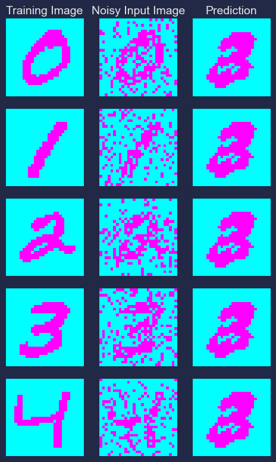
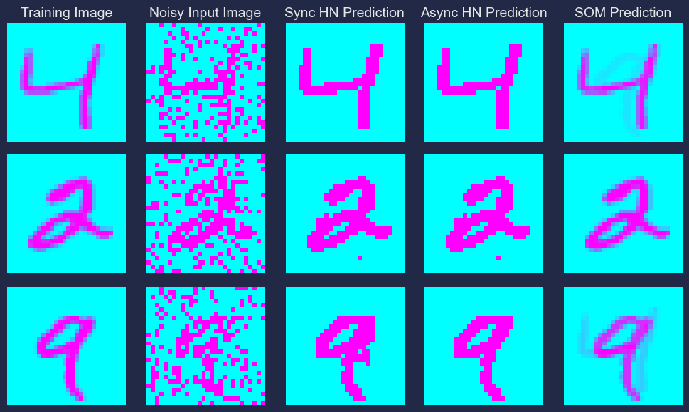

##############
Introduction
##############

This is an implementation of the Hopfield Network for COMP5400M Bio-Inspired Computing: Coursework 2. 
The task is to evaluate image reconstruction using synchronous pattern recovery, and compare results with the asynchronous 
approach and Self-Organising Map. Experiments are performed using the `MNIST <http://yann.lecun.com/exdb/mnist/>`_ dataset. 

++++++++++++++++++
Hopfield Network
++++++++++++++++++

Hopfield networks are recurrent neural networks that serve as autoassociative memory systems. This means that they can store 
patterns and retrieve them later from noisy input. 

In this implementation, the Hebb rule is used to train the network. This approach can be summarized as: 
**Neurons that fire together, wire together**. Training requires input vectors to be -1 or 1, so MNIST images are 
binarized while preprocessing.

For pattern recovery, the **synchronous approach** is used, which applies the :math:`sign(x)` function to the multiplication of the 
weight matrix by the input vector.

Limitations
*************

Spurious states in Hopfield Networks are bogus patterns, absent from the the training data, that correspond to local minima 
in the energy function. They can be composed of combinations of the original patterns or the negation of a particular pattern 
in the training set. These arise when the ration P/N becomes too high, where P is the number of patterns to be learnt, and 
N is the number of neurons in the network.

An illustration of the same using synchronous hopfield is given below:

+++++++++++++++++++++++++++++++++++++++++
Reconstruction Sample
+++++++++++++++++++++++++++++++++++++++++

The image below shows an example of the inputs, outputs and predictions for the image reconstruction task, using all 3 approaches.

*Note: Visualisation for Asynchronous Hopfield Network is done using Ruchita Mijagiri's code*

