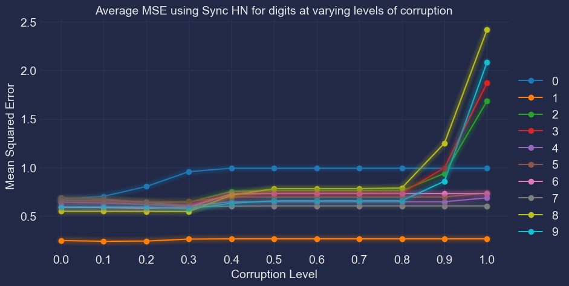
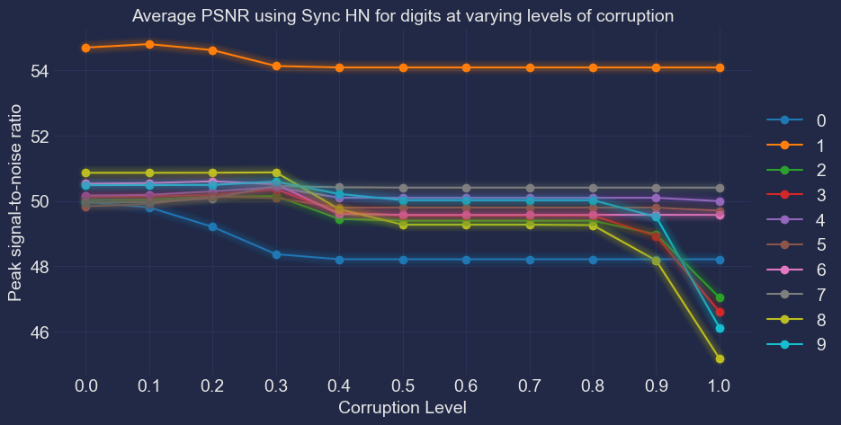
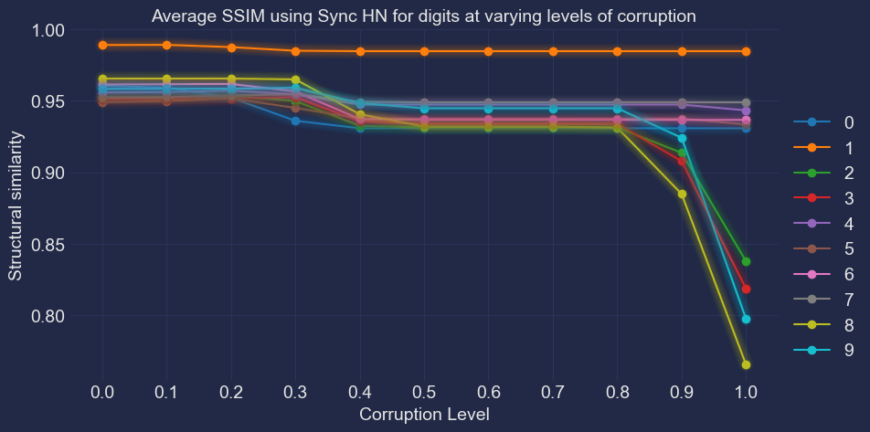
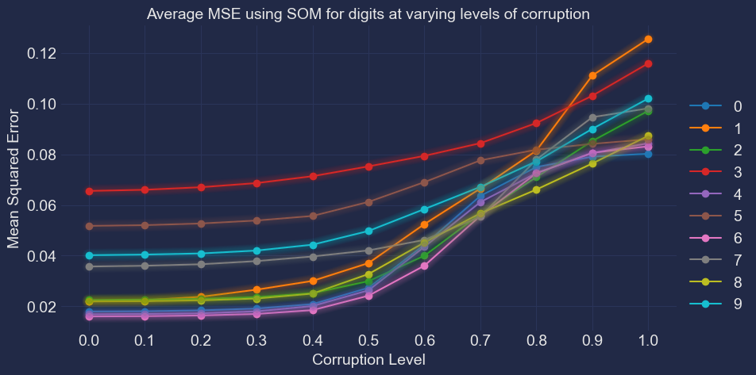
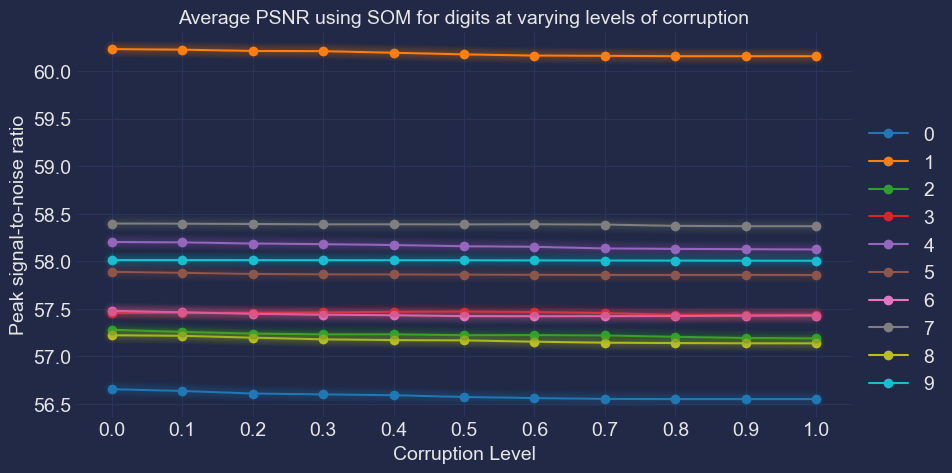
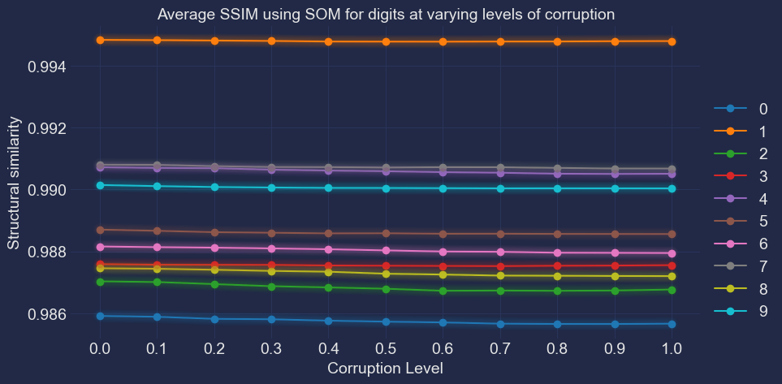
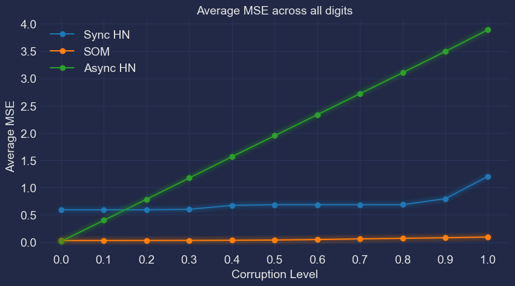
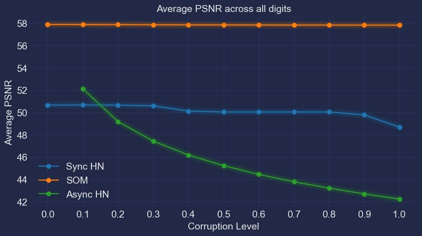
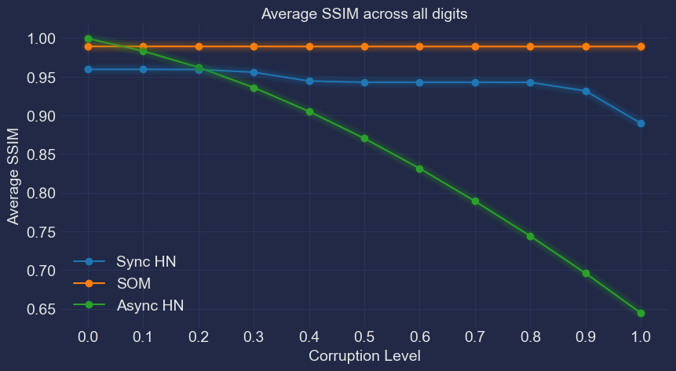

######################
Results
######################

Metrics Used
*******************
#. Mean squared error (MSE)
#. Peak signal-to-noise ratio (PSNR)
#. Structural similarity (SSIM)

Evaluation Strategy
**********************

Synchronous Hopfield Network
*****************************

Self-Organising Map
**********************

Sync HN vs Async HN vs SOM
****************************

Metrics aggregated across all 10 digits.

*Note: Metrics for Asynchronous Hopfield Network are derived using Ruchita Mijagiri's code*

