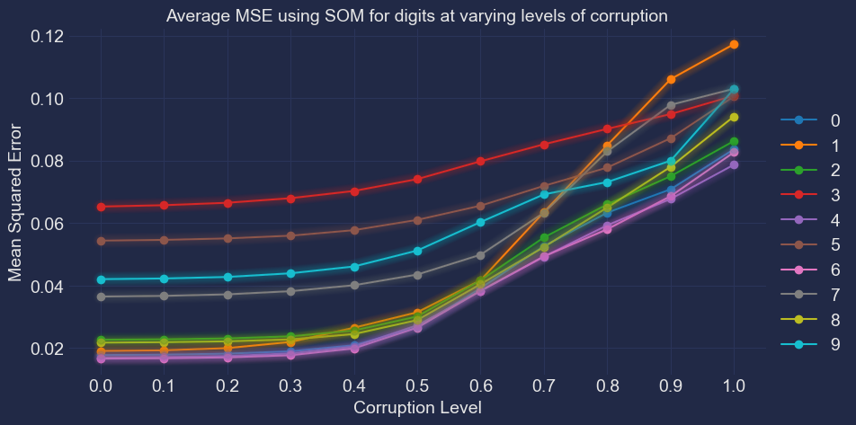
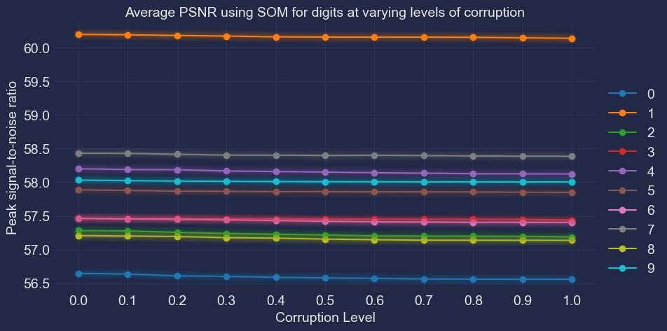

##############
Results
##############

Metrics Used
*******************
#. Mean squared error (MSE)
#. Peak signal-to-noise ratio (PSNR)
#. Structural similarity (SSIM)

Synchronous Approach
**********************

.. image:: assets/sync_psnr.png
  :width: 400

.. image:: assets/sync_ssim.png
  :width: 400

Self-Organising Map
**********************

.. image:: assets/som_ssim.png
  :width: 400

Sync HN vs Async HN vs SOM
****************************
